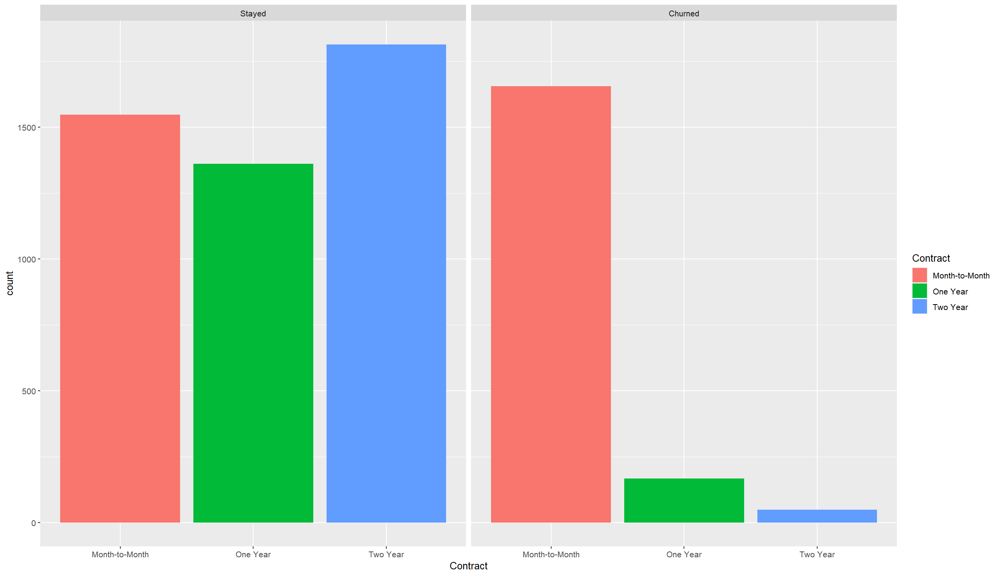
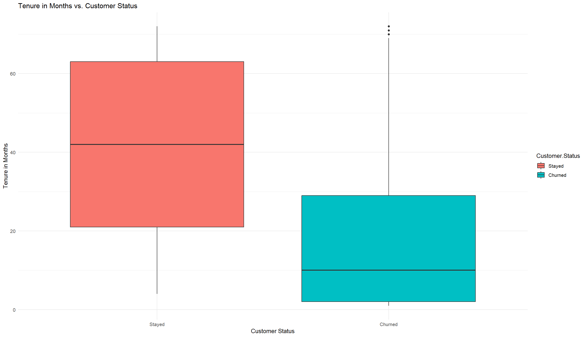
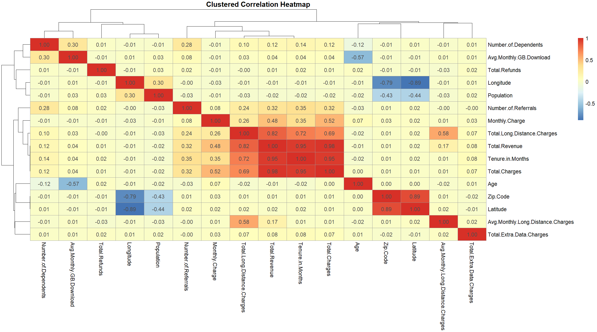
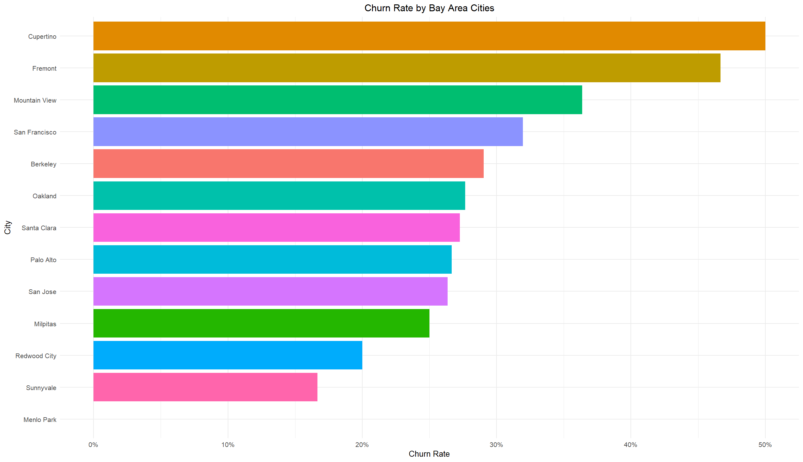

# Telecom Customer Churn Analysis with R

This repository contains my Spring 2024 final project for **ALY6015 – Intermediate Analytics** at Northeastern University, Silicon Valley.

This was a **group project** completed with **Cheng Liu** and **Chandana Yalavarthi**. The project focuses on customer churn analysis for a California telecom dataset and combines exploratory data analysis, customer segmentation, and a basic modeling section.

## Project Summary

The project explores which factors are associated with customer churn and retention.  
We merged a telecom customer table with a zipcode population table and then analyzed churn patterns across contract type, tenure, age, payment behavior, and geography.

The public portfolio version of this repository focuses on the work I contributed most directly: data preparation, exploratory analysis, segmentation, visualizations, and business interpretation.

## My Role

I mainly worked on:
- data merging and inspection
- missing value review
- exploratory data analysis in R
- churn pattern analysis
- customer segmentation
- Bay Area city-level analysis
- interpretation of business insights

The modeling section in the original course submission was primarily contributed by my teammate and is referenced here as part of the full group project record.

## Dataset

The original course project used:
- a telecom customer churn dataset
- a zipcode population dataset

The two datasets were merged by `Zip.Code`.

The final merged dataset described in the report contains:
- **7,043 rows**
- **39 columns**

For the public portfolio version, raw CSV files are not included.  
See [`data/README.md`](data/README.md) for the data note.

## Main Questions

This project was built around four main questions:

1. What factors appear to contribute most to customer retention?
2. How can customers be segmented for retention or marketing strategies?
3. What service usage patterns relate to churn?
4. How well can churn be predicted using logistic regression and regularized models?

## Main Findings

Some of the main patterns observed in the project were:

- Month-to-month customers were much more likely to churn
- Customers with shorter tenure churned more often
- Younger customers showed slightly higher churn
- Unmarried customers had higher churn than married customers
- Bank withdrawal users appeared to churn more than credit card users
- Competition and dissatisfaction were common churn themes
- Some Bay Area cities showed higher churn rates, though small sample sizes should be interpreted carefully

## Repository Structure

- `scripts/01_eda_analysis.R` — my EDA workflow in R
- `scripts/02_modeling_note.md` — note about the modeling section from the original group project
- `outputs/figures/` — selected visual outputs
- `reports/final-project-report.pdf` — final written report
- `slides/final-project-presentation.pdf` — final presentation
- `archive/` — earlier course deliverables
- `data/README.md` — dataset note for the public version

## Selected Figures

### Contract vs Customer Status

### Tenure in Months vs Customer Status

### Clustered Correlation Heatmap

### Churn Rate by Bay Area Cities

## Notes

This repository is a portfolio version of the original course project. It keeps the report, presentation, selected figures, and code that I prepared for the project.

The original course submission also included a predictive modeling section with logistic regression, lasso, ridge, and ROC/AUC discussion. That section is preserved through the report and slide deck, while the main reproducible script currently included here is the EDA workflow that I prepared.

## Related Files

- [Final Report](reports/final-project-report.pdf)
- [Final Presentation](slides/final-project-presentation.pdf)
- [M2 Proposal / Dataset Selection](archive/m2-proposal-dataset-selection.pdf)
- [M4 Initial Analysis Report](archive/m4-initial-analysis-report.pdf)