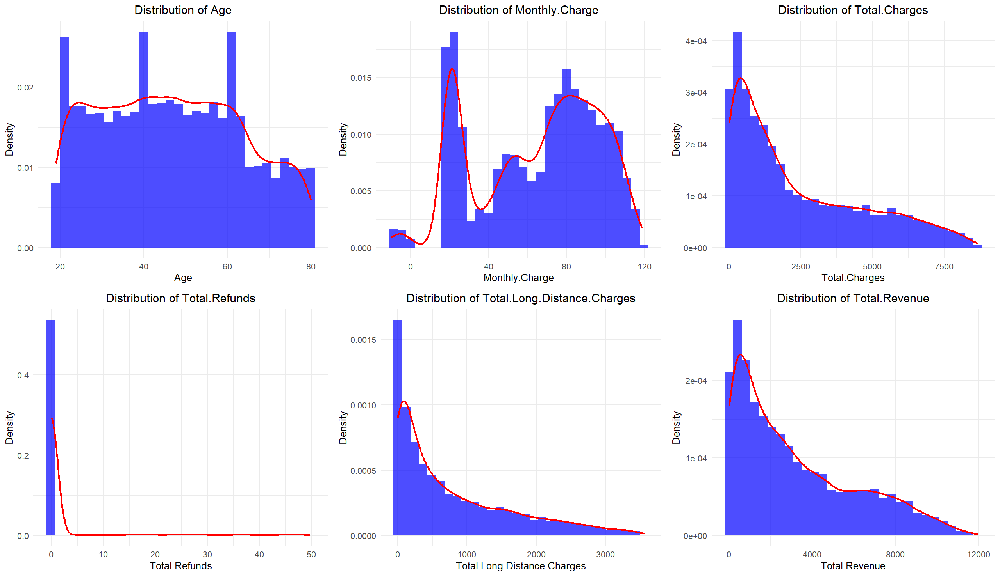
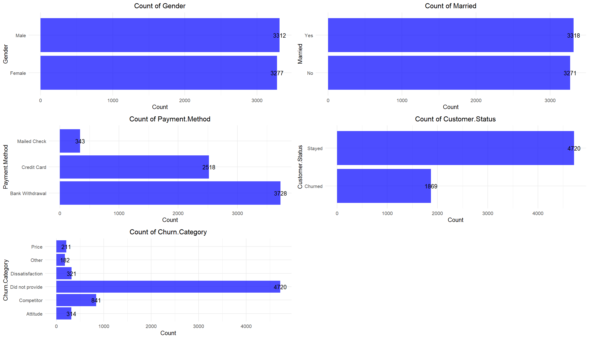
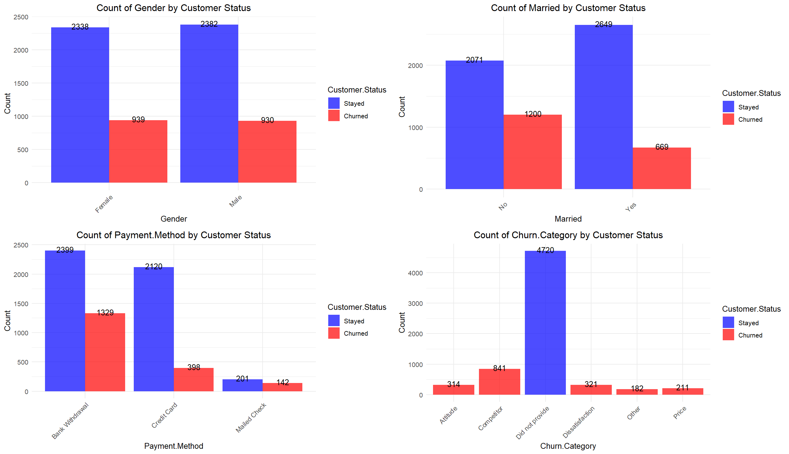
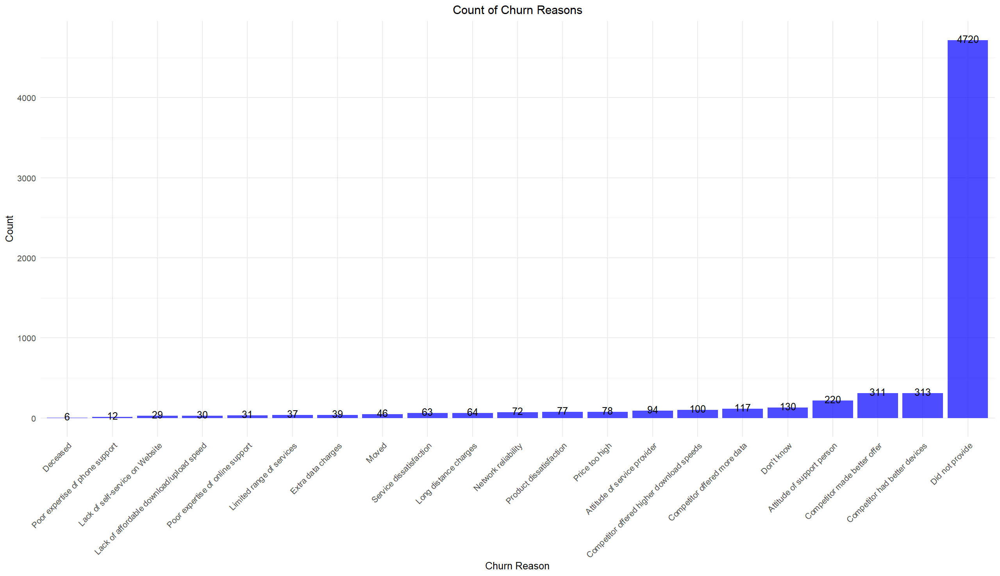
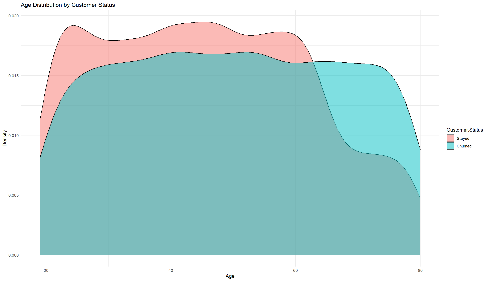
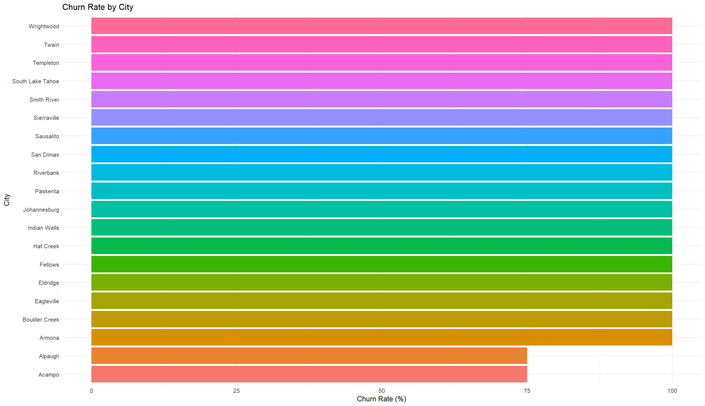
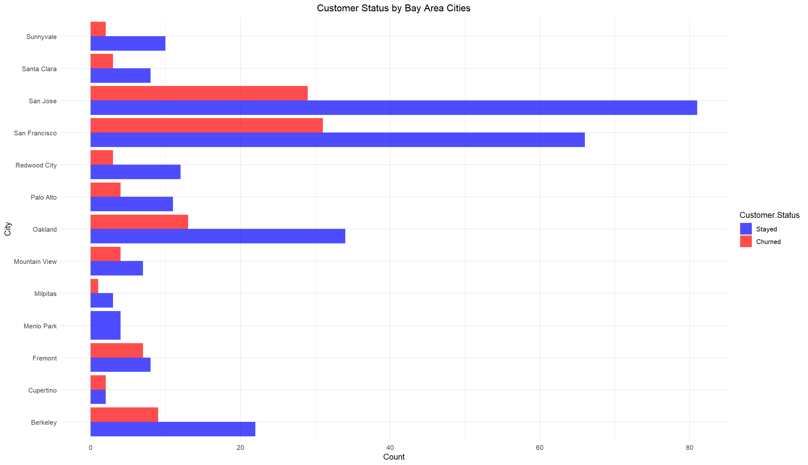

# EDA Walkthrough

This page is a cleaner walkthrough of the exploratory data analysis part of my ALY6015 final project.

This was a group project completed in **ALY6015 - Intermediate Analytics** at Northeastern University, Silicon Valley. The work here mainly reflects the part I worked on most directly: data preparation, exploratory analysis, churn pattern exploration, segmentation, Bay Area city-level analysis, and business interpretation.

The goal of this walkthrough is to make the EDA easier to follow from a GitHub portfolio or interview perspective.

---

## Quick Links

- [EDA script](../scripts/01_eda_analysis.R)
- [Modeling note](../scripts/02_modeling_note.md)
- [Final report](../reports/final-project-report.pdf)
- [Final presentation](../slides/final-project-presentation.pdf)
- [Telecom dataset](../data/telecom_customer_churn.csv)
- [Zipcode dataset](../data/telecom_zipcode_population.csv)
- [Data dictionary](../data/telecom_data_dictionary.csv)

---

This walkthrough references selected JPG figures preserved in `outputs/figures/`. The included R script shows the main EDA steps, but it does not currently export every committed figure file.

---

## 1. Problem Context

The purpose of this analysis was to understand which factors were associated with customer churn and which patterns could help explain customer retention.

For a telecom company, churn analysis can help a retention or marketing team think about:

- which customer groups may need more attention
- which contract or payment patterns are linked with churn
- which churn reasons appear most often
- whether geography adds useful segmentation context

This project is mainly an exploratory business analytics project. It is not intended to prove causal drivers of churn or serve as a production churn model.

---

## 2. Data Source and Scope

I used two datasets stored in the repository:

- `data/telecom_customer_churn.csv`
- `data/telecom_zipcode_population.csv`

The customer churn table contains **7,043 rows** and **38 columns**. The zipcode population table contains **1,671 rows** and **2 columns**. The two tables were merged by `Zip.Code`, creating a merged dataset with **39 columns**.

The main status field is `Customer.Status`, with customer records labeled as `Stayed`, `Churned`, or `Joined`.

---

## 3. Load and Merge the Data

The two tables were merged by `Zip.Code` so that the churn analysis could include geographic context.

```r
telecom <- read.csv("data/telecom_customer_churn.csv")
zipcode <- read.csv("data/telecom_zipcode_population.csv")

merged_telecom <- merge(
  telecom,
  zipcode,
  by.x = "Zip.Code",
  by.y = "Zip.Code",
  all.x = TRUE
)

merged_telecom <- as_tibble(merged_telecom)
```

This step created one combined dataset for the rest of the analysis.

---

## 4. Initial Data Review

Before building any plots, I checked the structure, summary statistics, and missing values.

```r
str(merged_telecom)
summary(merged_telecom)
sapply(merged_telecom, function(x) sum(is.na(x)))
```

This helped me understand:

- the size of the dataset
- the variable types
- where missing values appeared
- which fields needed careful interpretation

I also removed customers with status `Joined` for the stayed-vs-churned comparison.

```r
merged_telecom <- merged_telecom %>% 
  filter(Customer.Status != "Joined")
```

This made the churn comparison more consistent because newly joined customers were not part of the stayed-vs-churned outcome being explored.

---

## 5. Distribution of Numerical Features

I first looked at the distribution of several numerical variables, including:

- Age
- Monthly Charge
- Total Charges
- Total Refunds
- Total Long Distance Charges
- Total Revenue

```r
numerical_features <- c(
  "Age",
  "Monthly.Charge",
  "Total.Charges",
  "Total.Refunds",
  "Total.Long.Distance.Charges",
  "Total.Revenue"
)
```

### Output



### Main Takeaway

Several revenue-related variables were right-skewed. Monthly charge also showed multiple peaks, which may reflect different pricing or service plan groups.

---

## 6. Distribution of Categorical Features

I then reviewed several major categorical variables:

- Gender
- Married
- Payment Method
- Customer Status
- Churn Category

I replaced blank churn categories with `Did not provide` so the plots would be easier to read.

```r
merged_telecom$Churn.Category[merged_telecom$Churn.Category == ""] <- "Did not provide"
```

### Output



### Main Takeaway

Gender and marital status looked fairly balanced in the overall population. Payment method and churn-related fields showed more visible differences and were useful for later stayed-vs-churned comparisons.

---

## 7. Categorical Features by Customer Status

Next, I compared several categorical variables by `Customer.Status`, especially:

- Gender
- Married
- Payment Method
- Churn Category

```r
merged_telecom$Customer.Status <- factor(
  merged_telecom$Customer.Status,
  levels = c("Stayed", "Churned")
)
```

### Output



### Main Takeaway

Gender did not look like a strong differentiator. Marital status and payment method appeared more informative in the EDA. Unmarried customers and some payment behavior patterns showed higher churn.

---

## 8. Churn Reasons

To make churn reasons easier to interpret, I replaced blank values in `Churn.Reason` with `Did not provide`, then reordered the categories by count.

```r
merged_telecom$Churn.Reason[merged_telecom$Churn.Reason == ""] <- "Did not provide"
```

### Output



### Main Takeaway

Among customers who gave a churn reason, competition and dissatisfaction were important themes. A large share of records had no specific churn reason provided.

Important limitation: `Churn.Category` and `Churn.Reason` are useful for explaining churn after it happens, but they should not be used as predictors in a real churn model because they are outcome-related fields.

---

## 9. Contract Type and Customer Status

I wanted to see whether contract type was related to churn.

```r
ggplot(merged_telecom, aes(x = Contract, fill = Contract)) +
  geom_bar() +
  facet_wrap(~ Customer.Status)
```

### Output


### Main Takeaway

Month-to-month customers showed much higher churn than customers on one-year or two-year contracts. This was one of the clearest patterns in the project.

---

## 10. Tenure and Customer Status

I also compared `Tenure.in.Months` between stayed and churned customers.

```r
ggplot(
  merged_telecom,
  aes(x = Customer.Status, y = Tenure.in.Months, fill = Customer.Status)
) +
  geom_boxplot()
```

### Output


### Main Takeaway

Customers who stayed generally had much longer tenure. Short-tenure customers were much more likely to churn.

---

## 11. Age Distribution by Customer Status

To compare age patterns, I used a density plot.

```r
ggplot(merged_telecom, aes(x = Age, fill = Customer.Status)) +
  geom_density(alpha = 0.5)
```

### Output



### Main Takeaway

Age was explored as part of the churn profile, but it was not as clear or central as contract type and tenure in this portfolio version. I would treat age as a descriptive segmentation variable rather than a main churn driver without further testing.

---

## 12. Correlation Heatmap

To better understand numeric relationships, I created a correlation matrix and clustered heatmap.

```r
numeric_vars <- merged_telecom[, sapply(merged_telecom, is.numeric)]
correlation_matrix <- cor(numeric_vars, use = "complete.obs")
```

### Output


### Main Takeaway

Revenue-related variables were strongly correlated with each other. This helped show which variables moved together and which might be redundant in later modeling.

---

## 13. Geographic Churn Analysis

I also explored whether churn patterns varied by population density, city, and Bay Area location.

### Churn Rate by City



### Churn Rate by Bay Area Cities


### Customer Status by Bay Area Cities



### Main Takeaway

Some cities showed higher churn rates than others, including several Bay Area cities. These results were useful for segmentation, but small customer counts can make city-level churn rates unstable. For a stronger version of this analysis, I would add a minimum customer-count filter before ranking cities by churn rate.

---

## 14. Modeling Discussion

The original final course submission also included a basic modeling section with logistic regression, ROC/AUC discussion, lasso regression, and ridge regression.

That section is preserved in:

- [Final report](../reports/final-project-report.pdf)
- [Final presentation](../slides/final-project-presentation.pdf)
- [Modeling note](../scripts/02_modeling_note.md)

The local repository does not currently include a clean standalone modeling script. For that reason, I describe the modeling as part of the group report rather than as a fully reproducible production model.

---

## 15. Final EDA Summary

This EDA helped identify several useful churn-related patterns:

- churn was higher among month-to-month customers
- shorter-tenure customers were more likely to churn
- marital status and payment behavior appeared more useful than gender
- competition and dissatisfaction showed up frequently in churn reasons
- geography added useful segmentation context, but city-level rates need sample-size caution

This part of the project gave the business side of the team project a clearer story before moving into the modeling section.

---

## 16. Limitations and Future Work

Important limitations:

- This was a course-based group project, not a production analytics system.
- The EDA shows associations, not causal proof.
- Churn reason/category fields are useful for interpretation but should not be used as predictors in a real churn model.
- City-level churn rates can be unstable when customer counts are small.
- The modeling section is documented in the report and slides, but it is not currently preserved as a clean standalone reproducible script.

Future improvements:

- add a reproducible R environment file
- make the EDA script export all selected figures
- add sample-size filters for city-level churn rankings
- add clearer churn-rate tables alongside count charts
- rebuild the modeling section with a train/test split, baseline comparison, and leakage checks
